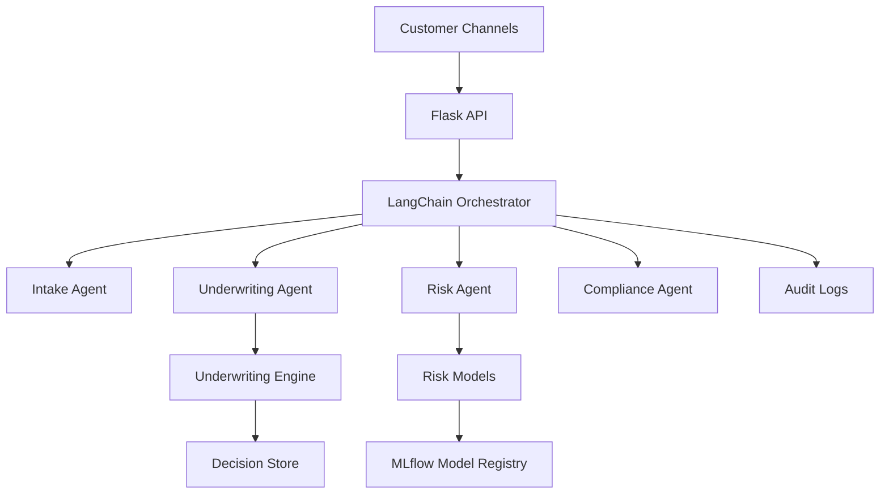

# SalesAI — Conversational Loan System

SalesAI is a production-oriented, agentic AI platform that automates the loan lifecycle through multi-agent orchestration, technical underwriting, and real-time risk evaluation. It delivers compliant, explainable decisions through a conversational interface that integrates with existing FinTech and banking systems.

## Core Objective
Automate the end-to-end loan lifecycle using an agentic multi-agent architecture that combines deterministic underwriting rules with ML-driven risk scoring.

## Key Features
- **Multi-agent orchestration** for intake, document collection, underwriting, risk scoring, and customer communication.
- **Technical underwriting engine** blending rules, policy checks, and model outputs.
- **Real-time risk evaluation** with low-latency scoring and configurable thresholds.
- **Explainability & auditability** with reason codes and decision trails.
- **Human-in-the-loop** escalation for edge cases and compliance review.
- **Integration-ready APIs** for KYC/AML, CRM, and core banking systems.
- **MLOps-ready** model tracking and promotion with MLflow.

## Architecture (High-Level)


## Tech Stack
- **Python**
- **LangChain** (agent orchestration)
- **MLflow** (model tracking, registry)
- **Flask** (API service)

## Target Audience
- FinTech platforms
- Banks and credit unions
- Digital lending teams
- Risk & compliance organizations

## Getting Started
### Prerequisites
- Python 3.10+
- pip / virtualenv
- Optional: Docker for containerized deployment

### Setup
```bash
python -m venv .venv
source .venv/bin/activate
pip install -r requirements.txt  # or use pyproject.toml/poetry/setup.py if preferred
```

### Configuration
Set environment variables (example values shown). The risk threshold is a normalized 0–1 cutoff used to approve/decline decisions (e.g., approve when score ≤ threshold) and should be calibrated to your portfolio and policy requirements:
```bash
export LLM_PROVIDER="openai"
export LLM_API_KEY="your_api_key"
export MLFLOW_TRACKING_URI="http://localhost:5000"
export MODEL_NAME="salesai-risk-model"
export RISK_THRESHOLD="0.62"  # example 0–1 cutoff; calibrate per policy and model performance
export AUDIT_LOG_LEVEL="INFO"
```

### Run Locally
```bash
export FLASK_APP=app.py  # update if your entrypoint differs
flask run --host 0.0.0.0 --port 8000
```

## API Surface (Example)
- `POST /v1/conversations` — start or continue a loan conversation.
  - **Input:** `conversation_id`, `message`, `channel`
  - **Output:** `response`, `next_actions`, `documents_required`
- `POST /v1/underwriting/decision` — request underwriting decision.
  - **Input:** `applicant_profile`, `financials`, `documents`, `requested_terms`
  - **Output:** `decision`, `risk_score`, `reason_codes`, `conditions`
- `GET /v1/decisions/{id}` — retrieve decision, rationale, and audit trail.

## MLOps & Model Lifecycle
- Track experiments and metrics in **MLflow**
- Promote approved models to the registry for production inference
- Monitor drift and recalibrate thresholds based on portfolio performance

## Observability & Compliance
- Centralized audit logs for every decision
- PII-safe logging and configurable data retention
- Role-based access control (RBAC) integration-ready

## Deployment
- **Development:** Flask built-in server
- **Production:** WSGI server (e.g., Gunicorn) behind a reverse proxy
- **Scaling:** containerized deployment via Docker/Kubernetes

## Roadmap
- **Short-term:** Real-time income verification integrations
- **Mid-term:** Multi-region latency optimization
- **Future:** SHAP-based model explainability

## License
This project is intended for portfolio and demonstration purposes. Add a LICENSE file if you plan to distribute or commercialize it.

## Contact
For collaboration or integration inquiries, reach out via your preferred professional channel.
